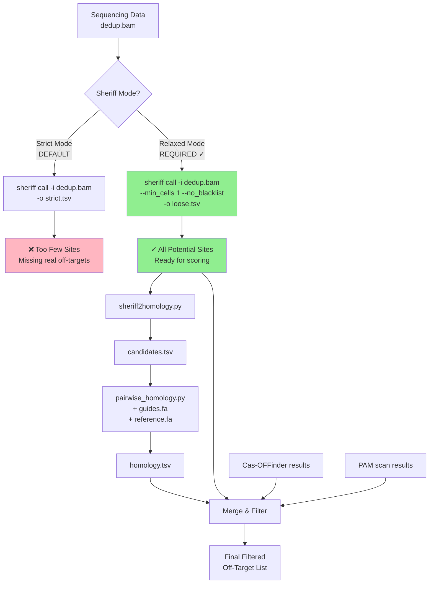

# Sheriff → Homology Extension Workflow

## Complete Pipeline Flow



## Why Relaxed Mode is Critical

### Sheriff Mode Comparison

| Aspect | Strict Mode (Default) | Relaxed Mode (Required) |
|--------|----------------------|-------------------------|
| Command | `sheriff call -i dedup.bam` | `sheriff call -i dedup.bam --min_cells 1 --no_blacklist` |
| Cell threshold | Drops sites with <2 cells | Keeps ALL sites (≥1 cell) |
| Blacklist | Applies repeat mask | No blacklist filtering |
| Output sites | ~100s-1000s | ~1000s-10000s |
| Use case | Publication figures | Homology scoring input |

### Example Impact

```bash
# Strict mode might show:
site_001    chr1:1000    cell_count=5    ✓ Kept
site_002    chr1:2000    cell_count=1    ❌ Filtered out
site_003    chr1:3000    cell_count=1    ❌ Filtered out

# Relaxed mode shows ALL:
site_001    chr1:1000    cell_count=5    ✓
site_002    chr1:2000    cell_count=1    ✓  <- Could be real off-target!
site_003    chr1:3000    cell_count=1    ✓  <- Perfect sequence match?
```

The single-cell sites (site_002, site_003) might have:
- Perfect guide homology (0 mismatches)
- Strong PAM sequences
- Co-occurrence with known off-targets

**We can only discover this by starting with relaxed mode!**

## File Format Evolution

```
Sheriff BAM → Sheriff TSV (relaxed) → candidates.tsv → homology.tsv → filtered results
           ↓
    [Alternative: Sheriff BED → edit_sites2loose.py → candidates.tsv]
```